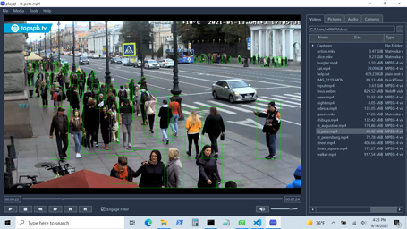

<table style="border: none">
<tr>
<td style="width:256px"></td>
<td>

Windows GUI framework using ffplay integrated with darknet neural network to process high definition real time streams.  Accurate object counting in 1080 resolution video at 18 fps running on an NVIDIA RTX 3080.

An installable version of the program for Windows is avialable at <a href="https://sourceforge.net/projects/playqt/">SOURCEFORGE</a>

The program will respond to the same command line options as ffplay and can be used with other command line tools such as ffmpeg and youtube-dl to process a wide variety of media.
</td></tr>
</table>

 
table {border: none;}

Compiled with Qt Creator using Qt version 6.0.2 which in turn depends upon MS Visual Studio 2019.

The core of the program is a C++ wrapper around ffplay which is used to process video that is fed through the darknet object detector.  The number of each of the objects is classified by type and the results may be recorded in Excel compatible format.

To compile, you will need the contrib libraries found at 

https://sourceforge.net/projects/playqt/files/

The build is set up to find the contrib libraries using the environment variable CONTRIB_PATH pointing to the location
where the libraries were unzipped.  The build will also look for the OpenCV include files in relation to an environment
variable OPENCV_PATH that should point to the root of the OpenCV source directory.

You will need to have NVIDIA cuda gpu development toolkit set up as well.  The build will look for the evironment variable CUDA_PATH which should be set up by the toolkit install.

The contrib libraries are only configured for release version of the program, so when you set up the Qt Creator environment, be sure to set it for Release configuration, not Debug.

At runtime, the program will look for some dll's in the contrib/bin directory, so you will want to add that to your path.  

https://developer.nvidia.com/cuda-toolkit

The program will respond to the same commands as ffplay from the prompt.  Click the play button to start playback.  The Engage Filter check box will not work for you unless you configure Tools->Model Options with a valid model weights file etc.

Darknet model code was compiled from a fork of AlexeyAB/darknet

https://github.com/sr99622/darknet

Several libraries are derived from the excellent Shift Media Project

https://github.com/ShiftMediaProject
