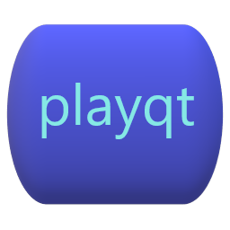

Windows GUI framework using ffplay integrated with darknet neural network to process high definition real time streams.  Accurate object counting in 1080 resolution video at 18 fps running on an NVIDIA RTX 3080.

An installable version of the program for Windows is avialable at <a href="https://sourceforge.net/projects/playqt/">SOURCEFORGE</a>

The program will respond to the same command line options as ffplay and can be used with other command line tools such as ffmpeg and youtube-dl to process a wide variety of media.

<h2>Features</h2>

The core of the program is a C++ wrapper around ffplay which is used to process video that is fed through the darknet object detector.  playqt behaves as any normal media client, but is optimized for use with machine learning libraries.

A built in camera control module uses ONVIF to control real time streams.  There is an object counting module that tallies the results of the detections for each frame of the video feed and will summarize them in an Excel compatible csv file.  Traffic analyis and people counting are easily achived using the built in counter.

playqt includes an alarm module that can be configured by the user.  Because of the level of control over the model parameters and alarm criteria, it is possible to virtually eliminate false alarms, even in very noisy conditions.  High and low count alarms are available.

<h2>Compilation</h2>

The program is built using Qt6 Creator, MSVC 2019, and the NVIDIA GPU Computing Toolkit, and CUDNN.  Libraries needed for the build can be found at <a href="https://sourceforge.net/projects/playqt/files/">contrib.zip</a> at the playqt repository on sourceforge.

The build is set up to find the contrib libraries using the environment variable CONTRIB_PATH pointing to the location
where the libraries were unzipped.

You will need to have NVIDIA cuda gpu development toolkit set up as well.  The build will look for the evironment variable CUDA_PATH which should be set up by the toolkit install.

The contrib libraries are only configured for release version of the program, so when you set up the Qt Creator environment, be sure to set it for Release configuration, not Debug.

At runtime, the program will look for some dll's in the contrib/bin directory, so you will want to add that to your path.  

<h2>Model Configuration</h2>

The program must be configured after installation to connect to the AI model. A sample model is provided at <a href="https://sourceforge.net/projects/playqt/files/">model.zip</a>. Download and unzip the model.zip file in your installation directory. By default this will be %HOMEPATH%/playqt.

Once the model has been unzipped, launch the program and use the menu bar at the top to go to Tools->Filters. On the right hand top side of the filter screen are the available filters, double click on darknet to activate the AI model screen.

There are three files that comprise the model - Names, Weight and Config. The three directory fields are used to point to those files. The three dot buttons on the right hand of the directory fields may be used to navigate to the files.

The model resolution can be adjusted in even increments of 32. Higher resolution will improve accuracy at the expense of longer processing times / lower frames per second. The threshold is the model confidence detection threshold. Lower thresholds will increase the number of objects detected at the expense of false positives.

To learn more about darknet, visit https://github.com/AlexeyAB/darknet for an excellent description of the framework and resources for developing customized models.  Darknet model code was compiled from a fork of AlexeyAB/darknet

<h2>Camera Configuration</h2>

Full control of ONVIF compatible cameras is available from the Cameras tab on the right side of the main screen. The config sub tab can be used to implement automatic discovery and launch of cameras.

If all cameras are configured to use the same user name and password, the common boxes may be filled for the info to be used during discovery. If the Auto Discovery box is checked, playqt will find the cameras on startup. The Auto Load Camera field nay specify a camera to start automatically at launch.

If the host computer has more than one network interface, it is possible to specify which network to use during the discovery. This feature is especially useful for isolating cameras on a subnet, a good practice that can improve performance and security.
<h2>Licenses</h2>

This program includes components compiled from other open source
software projects, their respective licenses are as follows:

<h3>Qt</h3>
This program is built with software developed by The Qt Company and
is licensed under GPLv2, GPLv3 and LGPLv3.

Please refer to https://doc.qt.io/qt-5/licenses-used-in-qt.html

<h3>FFMPEG</h3>
Most files in FFmpeg are under the GNU Lesser General Public License version 2.1
or later (LGPL v2.1+). Read the file `COPYING.LGPLv2.1` for details. Some other
files have MIT/X11/BSD-style licenses. In combination the LGPL v2.1+ applies to
FFmpeg.

Some optional parts of FFmpeg are licensed under the GNU General Public License
version 2 or later (GPL v2+). See the file `COPYING.GPLv2` for details. None of
these parts are used by default, you have to explicitly pass `--enable-gpl` to
configure to activate them. In this case, FFmpeg's license changes to GPL v2+.

Please refer to https://www.ffmpeg.org/legal.html for more detail.

<h3>NVIDIA</h3>
This program is built with software developed by NVIDIA Corporation.  Please
refer to https://docs.nvidia.com/cuda/eula/index.html for further information.

<h3>SDL</h3>
Simple DirectMedia Layer
Copyright (C) 1997-2018 Sam Lantinga <slouken@libsdl.org>

This software is provided 'as-is', without any express or implied
warranty.  In no event will the authors be held liable for any damages
arising from the use of this software.

Permission is granted to anyone to use this software for any purpose,
including commercial applications, and to alter it and redistribute it
freely, subject to the following restrictions:

<ol type="1">
<li> The origin of this software must not be misrepresented; you must not
   claim that you wrote the original software. If you use this software
   in a product, an acknowledgment in the product documentation would be
   appreciated but is not required. </li>
<li> Altered source versions must be plainly marked as such, and must not be
   misrepresented as being the original software.</li>
<li> This notice may not be removed or altered from any source distribution.</li>
</ol>

<h3>LIBXML</h3>

Except where otherwise noted in the source code (e.g. the files hash.c,
list.c and the trio files, which are covered by a similar licence but
with different Copyright notices) all the files are:

 Copyright (C) 1998-2012 Daniel Veillard.  All Rights Reserved.

Permission is hereby granted, free of charge, to any person obtaining a copy
of this software and associated documentation files (the "Software"), to deal
in the Software without restriction, including without limitation the rights
to use, copy, modify, merge, publish, distribute, sublicense, and/or sell
copies of the Software, and to permit persons to whom the Software is fur-
nished to do so, subject to the following conditions:

The above copyright notice and this permission notice shall be included in
all copies or substantial portions of the Software.

THE SOFTWARE IS PROVIDED "AS IS", WITHOUT WARRANTY OF ANY KIND, 
EXPRESS OR IMPLIED, INCLUDING BUT NOT LIMITED TO THE WARRANTIES 
OF MERCHANTABILITY, FITNESS FOR A PARTICULAR PURPOSE AND 
NONINFRINGEMENT.  IN NO EVENT SHALL THE AUTHORS OR COPYRIGHT 
HOLDERS BE LIABLE FOR ANY CLAIM, DAMAGES OR OTHER LIABILITY, 
WHETHER IN AN ACTION OF CONTRACT, TORT OR OTHERWISE, ARISING FROM,
OUT OF OR IN CONNECTION WITH THE SOFTWARE OR THE USE OR OTHER 
DEALINGS IN THE SOFTWARE.

<h3>LIBONVIF</h3>
This library is free software; you can redistribute it and/or modify it under
the terms of the GNU Lesser General Public License as published by the
Free Software Foundation; either version 3 of the License, or (at your
option) any later version. (See http://www.gnu.org/copyleft/lesser.html.)

This library is distributed in the hope that it will be useful, but WITHOUT
ANY WARRANTY; without even the implied warranty of MERCHANTABILITY or FITNESS
FOR A PARTICULAR PURPOSE.  See the GNU Lesser General Public License for
more details.

You should have received a copy of the GNU Lesser General Public License
along with this library; if not, write to the Free Software Foundation, Inc.,
51 Franklin Street, Fifth Floor, Boston, MA 02110-1301  USA

<h3>SHA1.C</h3>
SHA-1 in C
By Steve Reid <steve@edmweb.com>
100% Public Domain

<h3>CENCODE.C</h3>
cencoder.c - c source to a base64 encoding algorithm implementation
This is part of the libb64 project, and has been placed in the public domain.
For details, see http://sourceforge.net/projects/libb64
**MODIFIED FOR LIBONVIF - remove trailing \n

<h3>ICONV.H</h3>
/* Copyright (C) 1999-2003, 2005-2006, 2008-2011 Free Software Foundation, Inc.
   This file is part of the GNU LIBICONV Library.

   The GNU LIBICONV Library is free software; you can redistribute it
   and/or modify it under the terms of the GNU Library General Public
   License as published by the Free Software Foundation; either version 2
   of the License, or (at your option) any later version.

   The GNU LIBICONV Library is distributed in the hope that it will be
   useful, but WITHOUT ANY WARRANTY; without even the implied warranty of
   MERCHANTABILITY or FITNESS FOR A PARTICULAR PURPOSE.  See the GNU
   Library General Public License for more details.

   You should have received a copy of the GNU Library General Public
   License along with the GNU LIBICONV Library; see the file COPYING.LIB.
   If not, see <http://www.gnu.org/licenses/>.  */

/* When installed, this file is called "iconv.h". */

Several libraries are derived from the excellent Shift Media Project

https://github.com/ShiftMediaProject
